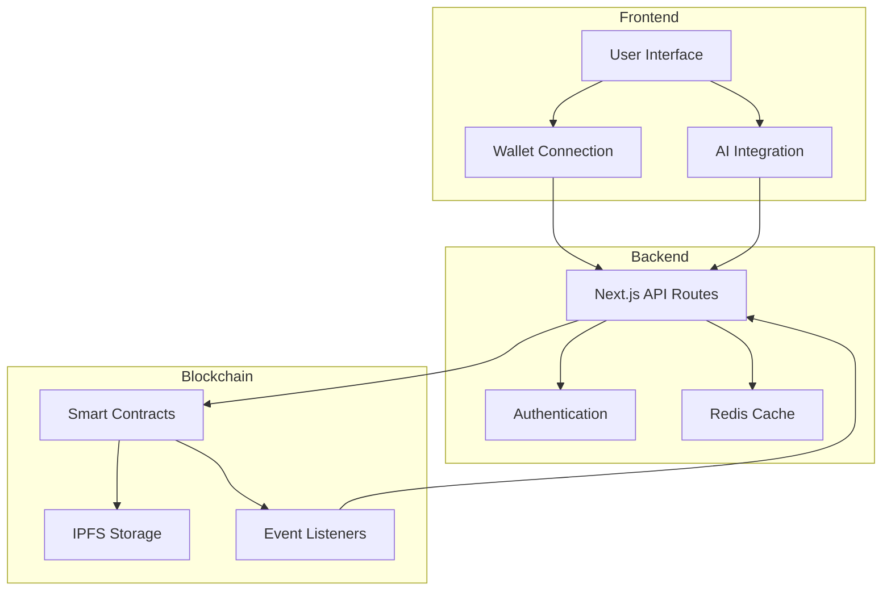
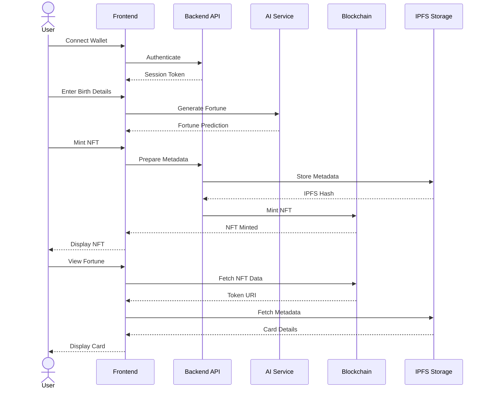

# Zodiac Card 🌟

> A decentralized fortune-telling NFT platform where users can mint unique zodiac-based fortune cards powered by AI.

## Overview

Zodiac Card is a Web3 application that combines astrology, NFTs, and AI to create unique fortune-telling experiences. Users can mint NFTs representing personalized fortune cards based on their zodiac sign, birth date, and current celestial alignments.

## Features

- 🎴 Mint unique Zodiac Fortune NFTs
- 🔮 AI-powered fortune predictions
- ⭐ Zodiac sign compatibility matching
- 🌌 Real-time celestial alignment integration
- 💫 Interactive card viewing experience
- 🔄 Secondary market trading capabilities

## Tech Stack

- **Frontend**: Next.js 14, React, TypeScript
- **Styling**: Tailwind CSS, Shadcn UI, Radix UI
- **Blockchain**: Solidity, Hardhat
- **Web3**: Viem v2, Wagmi v2
- **AI/ML**: OpenAI GPT-4
- **Authentication**: NextAuth.js, Wallet Connect
- **Testing**: Vitest, Hardhat Test

## Architecture



## Workflow



## Project Structure

```
zodiac-card/
├── app/                    # Next.js 14 app directory
│   ├── api/               # API routes
│   ├── components/        # React components
│   └── pages/            # App pages
├── contracts/            # Solidity smart contracts
├── lib/                  # Utility functions
├── public/              # Static assets
└── styles/              # Global styles
```

## Getting Started

1. Clone the repository
```bash
git clone https://github.com/yourusername/zodiac-card.git
cd zodiac-card
```

2. Install dependencies
```bash
pnpm install
```

3. Set up environment variables
```bash
cp .env.example .env.local
```

4. Run the development server
```bash
pnpm dev
```

5. Deploy smart contracts (coming soon)
```bash
pnpm hardhat deploy --network <network>
```

## Contributing

Contributions are welcome! Please read our [Contributing Guidelines](CONTRIBUTING.md) for details on our code of conduct and the process for submitting pull requests.

## License

This project is licensed under the MIT License - see the [LICENSE](LICENSE) file for details.

## Contact

- Website: [zodiaccard.xyz](https://zodiaccard.xyz)
- Twitter: [@ZodiacCardNFT](https://twitter.com/ZodiacCardNFT)
- Discord: [Join our community](https://discord.gg/zodiaccard)